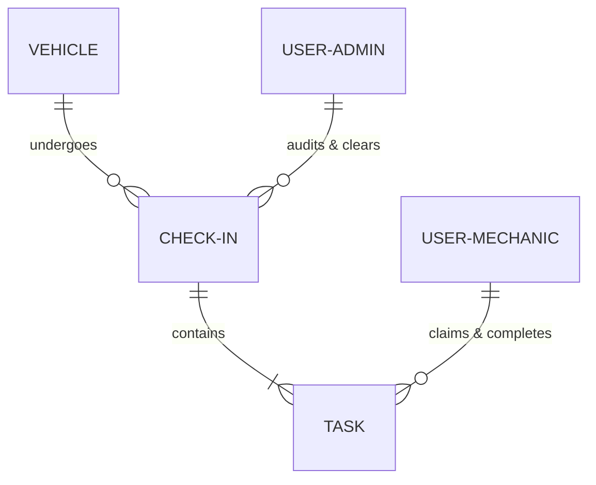
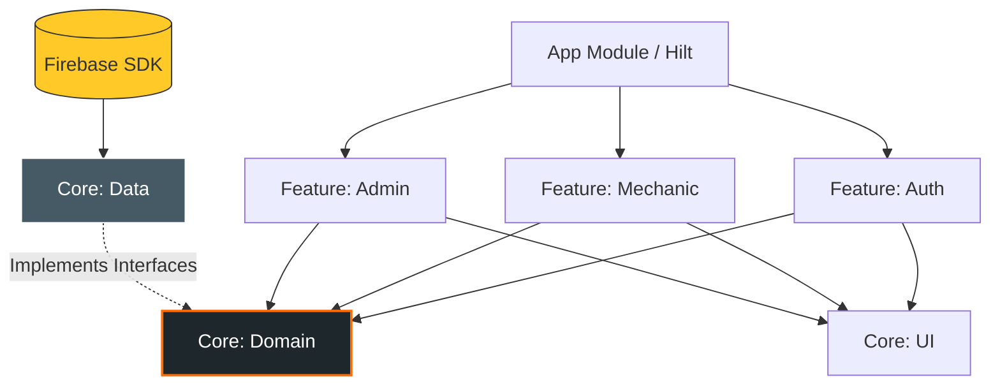
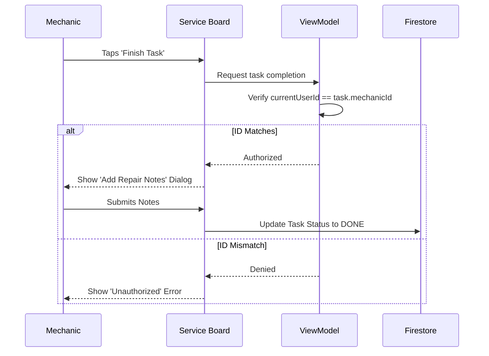
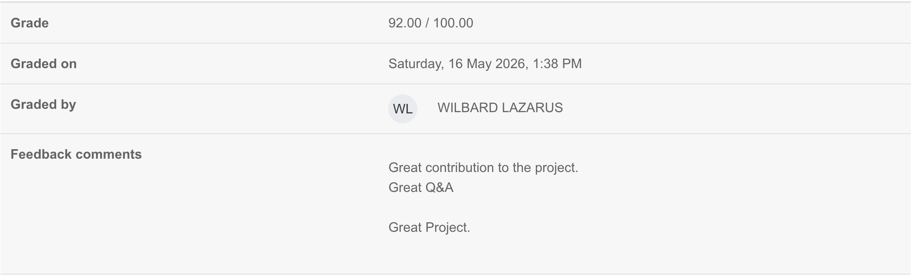

# Valentine’s Garage: Precision Diagnostics & Repair Portal

Welcome to the **Valentine’s Garage App** project. This document outlines our custom-built Android solution designed to digitize and streamline operations at Valentine's Garage, showcasing our journey from the initial problem statement to our final technical implementation.

**The Development Team:**
- **Silvio Ivanio (Architect & Project Manager):** Foundation, Architecture, and Project Orchestration.
- **Chido Kavai (UI Lead):** Jetpack Compose and Navigation.
- **Kirubel Hailu (Business Logic Lead):** State Management and Analytics.
- **Pinto Kabinda (QA Lead):** Automated Testing and Verification.

---

## **1. The Challenge & Our Solution**

**The Challenge:**
Valentine's Garage struggled with paper-based task mismanagement. Mechanics lacked clear accountability, and the administrative team could not easily track which technician performed specific repairs or the exact time of completion.

**The Solution:**
We engineered a 100% Kotlin-based Android application utilizing a modern Jetpack Compose UI. Designed with a "Digital Foreman" aesthetic—industrial orange, steel grey, and clean, distraction-free interfaces—the app provides:
- Real-time vehicle check-in and data logging.
- Synchronized, role-based task claiming for mechanics.
- Automated, exportable audit trails for administrators.

**Database Structure (NoSQL):**

---

## **2. Technical Excellence & Architecture**

The project is engineered using a strict Multi-Module MVVM architecture across 8 distinct modules. 

**Dependency Inversion:** 
Our feature modules (UI/ViewModels) have absolute zero knowledge of Firebase. They interact entirely through pure Kotlin Domain Interfaces, making our codebase highly decoupled and testable. The tech stack includes Firebase Authentication, Firestore Database, Dagger Hilt for dependency injection, and Kotlin Coroutines/StateFlow for unidirectional data flow.

**Multi-Module Dependency Graph:**

---

## **3. Key Features & Innovation**

### **Zero-Latency Offline Support**
Garages often have network dead-zones. We implemented native Firestore caching (`Source.CACHE`) and `addSnapshotListener` to ensure mechanics can log in and tick off tasks instantly, even without an active internet connection.

### **Native Android Integrations**
The Admin Audit Trail utilizes Android's native `PrintManager` for PDF report generation and `Intent.ACTION_SEND` for external sharing, ensuring the app feels native to the ecosystem.

### **Accountability Security**
A mechanic can only finalize a task if their specific User ID matches the ID of the mechanic who started it, ensuring an unforgeable audit trail.

**Security Sequence:**

---

## **4. Team Collaboration & Task Separation**

This project was built collaboratively, ensuring strict separation of concerns both in our code and our team workflow. Silvio Ivanio established the foundational architecture, allowing our leads (Pinto Kabinda, Kirubel Hailu, and Chido Kavai) to implement the UI, business logic, and automated testing in parallel.

| Phase / Milestone | Silvio Ivanio (Architect/PM) | Chido Kavai (UI) | Kirubel Hailu (Logic) | Pinto Kabinda (QA) |
| :--- | :---: | :---: | :---: | :---: |
| **Foundation (Infrastructure)** | **R/A** | I | I | I |
| **Design System (Theme/Models)** | **R/A** | C | C | I |
| **Repository Layer (Data)** | **R/A** | I | C | C |
| **Auth & Navigation (Flow)** | C | **R/A** | C | I |
| **Mechanic Flow (Core Feature)** | **R/A** | **R/A** | **R/A** | **R/A** |
| **Admin Flow (Analytics)** | C | C | **R/A** | C |
| **Quality Assurance (Testing)** | C | I | I | **R/A** |

**Legend:**
- **R (Responsible):** Who is performing the task.
- **A (Accountable):** Who ensures the task is completed correctly.
- **C (Consulted):** Who provides input/expertise.
- **I (Informed):** Who is kept updated on progress.

---

## **5. Quality Assurance & Verification**

- **Automated Testing:** We implemented both JVM Unit Tests (using MockK to verify our data grouping logic) and Jetpack Compose Instrumentation Tests (to verify UI behavior).
- **Code Quality:** The application compiles cleanly with zero major architectural lint warnings and no redundant code.
- **Performance:** We ensured strict memory management by tying all real-time listeners directly to the `ViewModelScope`, preventing memory leaks during long shifts at the garage.

---

## **6. Academic Showcase, Q&A & Evaluation**

On **Friday, 15 May 2026**, our team officially presented and showcased the **Valentine’s Garage App** to **Lecturer Wilbard Lazarus**. 

During this official academic showcase:
- **Interactive Live Demonstration:** We demonstrated the live, role-based workflows—from vehicle check-in to real-time mechanic task-claiming and final administrative PDF audit trail reports.
- **Architectural Defense:** We explained our decoupled multi-module architecture, showing how Dagger Hilt manages dependencies without exposing feature modules to Firebase-specific logic.
- **Interactive Q&A Session:** The entire team participated in a rigorous and comprehensive Q&A session. We successfully answered every technical, architectural, and design decision question without hesitation, highlighting our depth of knowledge in Kotlin Coroutines, StateFlow, memory safety, and unit/instrumentation testing.

Following this presentation, the project was officially graded, achieving an outstanding score of **92.00 / 100.00**.

### **Official Feedback Comments from Lecturer Wilbard Lazarus:**
> **"Great contribution to the project. Great Q&A. Great Project."**

---
